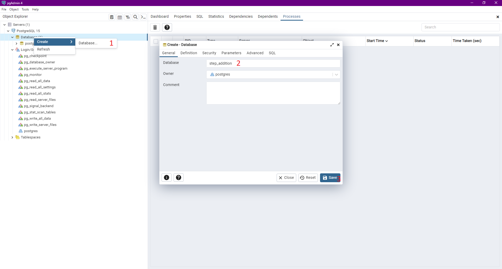
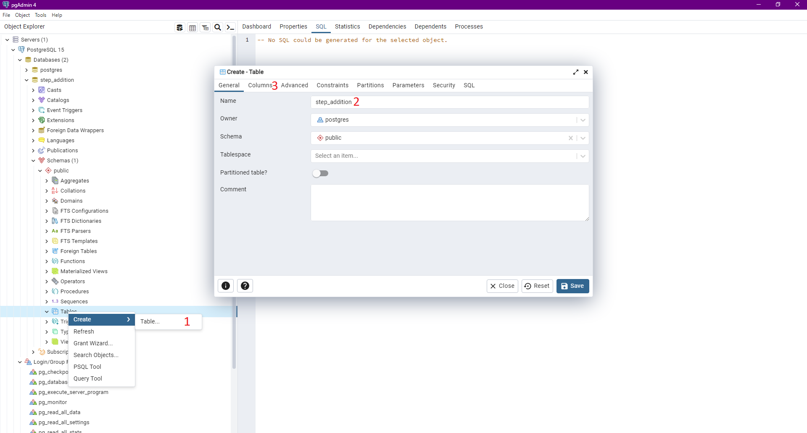
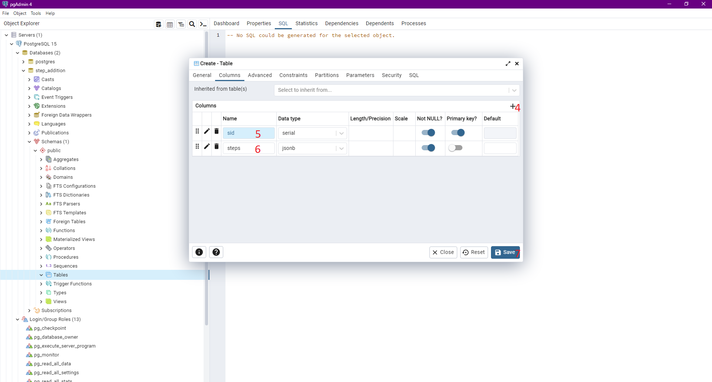

# A simple NextJS and PostgreSQL project using Typescript

## Database

- Install the PostgreSQL Service (https://www.enterprisedb.com/postgresql-tutorial-resources-training?uuid=c70fc67b-ca1f-4dc2-b73b-ccb7367fb6b8&campaignId=Product_Trial_PostgreSQL_15) by setting both the username and password to "`postgres`".

- Go to Start Menu and search "`pgAdmin4`" and run it.



- Create DB "`step_addition`"



- Create Table "`step_addition`" with "`sid`" (primary key, not null, serial) and "`steps`" (not null, jsonb)



## Next.js

- Install dependencies.

```
cd NextJS-PostgreSQL-with-Typescript
npm i
```

- Start Service.

```
npm run dev
```

- Go to "`http://localhost:3000`"
